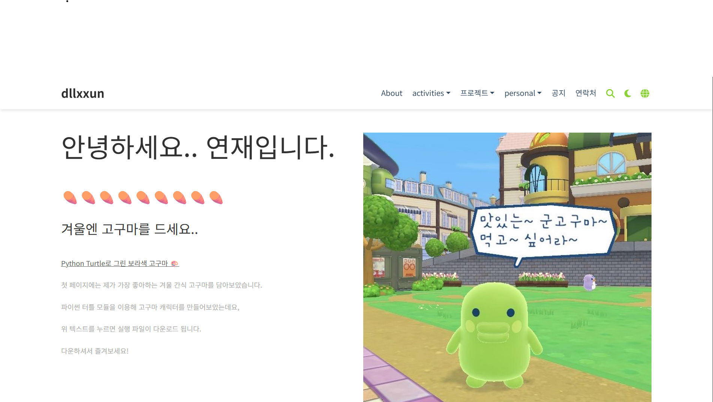

# [최연재의 포트폴리오](https://dllxxun.github.io)

25-2 초급프로젝트 | 전북대학교 최연재의 포트폴리오 웹사이트입니다.



---

## 🚀 프로젝트 개요

| 항목 | 내용 |
|------|------|
| **프레임워크** | [Hugo](https://gohugo.io/) |
| **템플릿** | 직접 커스터마이징 / Hugo 테마 기반 |
| **사용 언어** | Markdown, HTML, CSS, YAML |
| **호스팅** | GitHub Pages / Netlify (선택) |
| **주요 섹션** | 자기소개, 이력서, 프로젝트, 개인 기록, 블로그 |

---

## 🧩 주요 기능

- **빠르고 가벼운 정적 사이트** (Hugo 기반)
- **심플하고 직관적인 디자인**
- **Markdown 기반 콘텐츠 관리**  
- **`config.yaml`을 통한 손쉬운 설정 변경**
- **검색엔진 최적화(SEO) 및 다국어 구조 지원**


---

## ⚙️ 설치 및 실행 방법

1. **Hugo 설치**  
   [공식 설치 가이드](https://gohugo.io/getting-started/installing/)를 참고하세요.

2. **저장소 클론**
   ```bash
   git clone https://github.com/your-username/your-portfolio.git
   cd your-portfolio

3. **개발 서버 실행**
    hugo server -D

4. **브라우저에서 확인**
    http://dllxxun.github.io

---

✨ **주요 페이지 소개**

[**About**](https://dllxxun.github.io/author/최연재) — 학력, 관심 분야, 전공 소개

[**awards & certifications**](https://dllxxun.github.io/awards/) — 자격증과 수상 내역 소개

Projects — [**쿠키런 프로젝트**](https://dllxxun.github.io/cookierun/), [**넷플릭스 클론 생성**](https://dllxxun.github.io/netflix/), [**AWS 기반 출석 관리 시스템**](https://dllxxun.github.io/studenmanagement/) 등

Personal— [**교환학생 일상**](https://dllxxun.github.io/exchange/), [**여행 기록**](https://dllxxun.github.io/sns/)

---

📄 **라이선스**
이 웹사이트는 개인 포트폴리오 및 교육 목적으로만 사용됩니다.
테마 및 구조는 오픈소스 Hugo 테마를 참고하여 수정하였습니다


